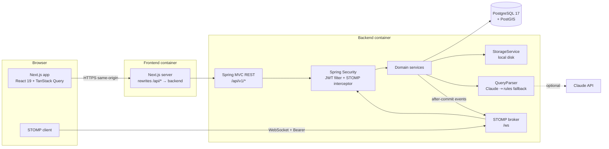

# Architecture

## System overview

## Key design decisions

### Geo search on PostGIS
`properties.location` is a `geography(Point, 4326)` **generated column** derived from `latitude`/`longitude`, so the
application writes plain doubles and the database keeps the spatial column consistent. A GiST index serves
`ST_DWithin` radius filtering, and `ST_Distance` provides the distance used for sorting and display. Other filters
(rent, BHK, type, furnishing, amenities via a GIN-indexed array, trigram text matching) are combined into a single
parameterised SQL query that `JdbcClient` builds dynamically. Sort keys come from a whitelist.

The map view uses a separate lightweight endpoint (`/search/properties/map`, capped at 500 pins) so that loading the
map never pulls in full listing cards.

### AI semantic search with a deterministic fallback
Natural-language queries ("2 BHK furnished near Koramangala under 35k for family with parking") are converted into the
same `SearchFilters` object that the filter panel produces. The search engine therefore has a single code path, and
the UI can show the extracted filters as editable chips.

- `ClaudeQueryParser` calls the Claude API with **structured outputs**. The JSON schema is derived from a Java record,
  so the response is always well-formed. The system prompt is static, which keeps it cacheable; the current date goes
  in the user turn so the model can resolve relative dates.
- The model output is treated as untrusted input. It is sanitised server-side: numbers are clamped and unknown enum
  values are dropped.
- `RuleBasedQueryParser` handles the same vocabulary with regexes and synonym tables. It runs when no API key is
  configured, on refusals, timeouts or errors. The response reports which parser was used (`AI` / `RULES`).
- Locality names are geocoded through a built-in gazetteer, so "near Koramangala" becomes a real radius search rather
  than a string match.
- Parsed queries are cached in memory to reduce latency and cost.

### Authentication
- Short-lived JWT access tokens (15 min) are kept **in memory** on the client, never in localStorage.
- Refresh tokens are opaque, stored as SHA-256 hashes, rotated on every use, and sent as an `httpOnly` cookie scoped
  to `/api/v1/auth`. If an already-rotated token is presented again, the whole session family is revoked (reuse
  detection).
- The Next.js server proxies `/api/*`, so the cookie is first-party and there's no cross-site cookie configuration to
  manage.
- Role-based authorisation (`TENANT`, `OWNER`, `ADMIN`) is enforced with method security. Ownership checks live in the
  service layer.

### Real-time chat, visits and notifications
STOMP over a native WebSocket. The CONNECT frame carries the access token, and a channel interceptor authenticates it
and binds the user principal. Each user receives messages on per-user queues (`/user/queue/...`).

Domain services publish application events, which are pushed over the socket only **after the transaction commits**
(`@TransactionalEventListener(AFTER_COMMIT)`). Clients therefore never see a message that was rolled back. Every chat
message is persisted first, and REST endpoints mirror the socket actions, so the UI degrades gracefully when the
socket is down.

To scale horizontally, the simple broker can be swapped for a STOMP relay (RabbitMQ/ActiveMQ) without changing
application code.

### Trust and safety: owner verification
Listings are publicly visible only when the listing is `ACTIVE`, the owner is `VERIFIED`, and the owner is not
suspended. This rule is enforced in **one SQL predicate** shared by every public query. Owners upload identity
documents to private storage (served only to that owner and admins). An admin reviews them and approves or rejects
with a reason. The owner is notified in real time.

### Visit scheduling
Visits are an explicit state machine (`REQUESTED → CONFIRMED / REJECTED / RESCHEDULE_PROPOSED → …`) with
role-specific transitions and optimistic locking. The counterparty's phone number is revealed only after a visit is
confirmed.

## Module layout

| Backend package | Responsibility |
|---|---|
| `auth` | Registration, login, JWT issue/verify, refresh-token rotation |
| `user` | Profile |
| `property` | Listings CRUD, images, ownership rules |
| `search` | Dynamic geo + filter query, map pins, localities |
| `ai` | Query parsers (Claude / rules), gazetteer, output sanitiser |
| `shortlist` | Tenant favourites |
| `visit` | Visit state machine |
| `chat` | Conversations, messages, STOMP handlers |
| `notification` | Persisted notifications and real-time push |
| `verification` | Owner KYC documents and submission |
| `admin` | Moderation, users, stats |
| `storage` | Pluggable file storage with content sniffing |
| `common` / `config` | Errors (RFC 9457), rate limiting, request IDs, security, WebSocket, OpenAPI |

The frontend mirrors this with `src/features/<domain>`. Route files in `src/app` stay thin.
